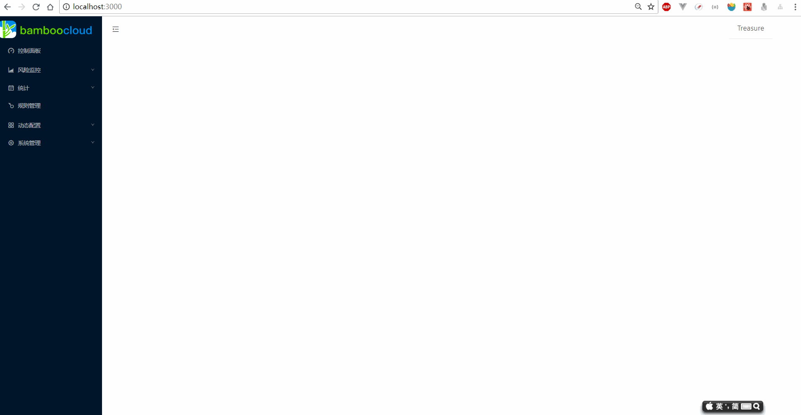
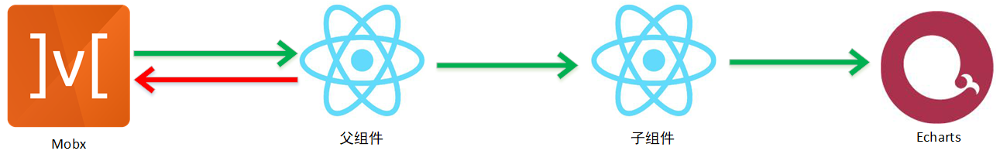

## 什么是数据驱动?
使用过Vue React框架我们就知道，我们不再更改某个DOM的innertext和innerhtml属性就能完成视图的改变，两者都是通过对状态的改变，唤起 virtualDOM 的diff方法，最终生成patch反应到真实DOM上。区别是Vue通过依赖收集观测数据的变化，而React是通过调用setState方法，不要小看这个区别。在结合ECharts的过程中，有着极大的不同。

尽管两者都是数据驱动的框架，不过它们仅仅改变的是DOM，不能直接唤起ECharts的改变(ECharts本身也是数据驱动的，通过适配不同的option，就能自动进行变换并且找到合理的动画过渡)。因此需要做一些适配。本文将浅谈在React中，完成ECharts的数据驱动所遇到的坑点

## 期待的效果
如最上面的gif动图展示的，最终我们的ECharts要实现两个效果
1. 尺寸变化引起的重绘 resize，有两种需要考虑的情况，第一个是页面尺寸的变化，即 window的 resize事件；第二种是上面的toggle按钮，导致容器的宽度发生变化。两者都需要进行 **chart.resize**
2. 数据驱动，通过用户触发DOM事件，让chart 进行重绘

## resize
本身实现resize并不复杂，ECharts为我们提供了 ECharts.resize 这个API。关键是调用这个API的时机。我们发现导致画面产生变化的因素只有两个。一个是 window.onresize 事件，另一个是toggle的点击事件。关于前者很多人都是在创建ECharts实例后，在window上绑定了事件，监听到变化时调用API。而后者处理的人就比较少，因为即使是不处理也能看。这当然是追求完美的我不能满足的。

仅仅从实现上来看，为每一个实例都 addEventlistener 不太划算。先不说不少人在实例销毁后忘记释放导致内存的占用。每一次都绑定一次也不符合 DRY 的原则。针对这个问题我做了如下处理

```javascript
// 注册一个事件中心
const eventCenter = new EventCenter()

class Base extends React.Component<IProps, any> {
    // 略掉不相关代码
    public async componentDidMount () {
      // ......
      EventCenter.on('resize', this.handleDOMChange)
    }

    public componentWillUnmount () {
      // ......
      this.chart && this.chart.dispose()
      delete this.chart
      EventCenter.off('resize', this.handleDOMChange)
    }

    private handleDOMChange () {
      this.chart && this.chart.resize()
    }
}
```
我注册了一个事件中心。在 ECharts 的基类Base中，每当ECharts初始化以后，我都在 EventCenter 中注册了 resize 事件， 在 Base 将要销毁的时候注销这个事件，并且释放 ECharts的相关资源。注意这个 handleDOMChange 是在 EventCenter 中执行的，this 指向会改变。因此在 constructor 中执行绑定 ```this.handleDOMChange = this.handleDOMChange.bind(this)```

```javascript
window.addEventListener('resize', () => {
    EventCenter.emit('resize')
})

handleToggle() {
    setTimeout(() => {
        EventCenter.emit('resize')
    }, 500)
}
```
在window和切换toggle中分别触发resize事件，这样EventCenter就会执行注册了的ECharts的resize方法。因为 Base 基类中也包含了注销事件，因此不会担心同一个ECharts注册多次导致内存的占用。

值得注意的是，在handleToggle的时候我设置了一个延时。这是因为点击了toggle按钮，视图并没有立即更新，即使这个时候 ECharts进行 resize 仍然取到的是不正确的宽度。应该等到视图更新完以后再进行resize。更加准确的是监听 AppMain(右侧主体)的 'transiationEnd' 事件。因为 antd 设置的变化时 .5s(CSS中的设置)，此处就偷懒直接写了500ms

```javascript
// ANTD-PRO中的实现

// antd\src\components\GlobalHeader
  @Debounce(600)
  triggerResizeEvent() {
    const event = document.createEvent('HTMLEvents');
    event.initEvent('resize', true, false);
    window.dispatchEvent(event);
  }

// antd\src\components\Charts\Bar
  @Bind()
  @Debounce(400)
  resize() {
    if (!this.node) {
      return;
    }
    const canvasWidth = this.node.parentNode.clientWidth;
    const { data = [], autoLabel = true } = this.props;
    if (!autoLabel) {
      return;
    }
    const minWidth = data.length * 30;
    const { autoHideXLabels } = this.state;

    if (canvasWidth <= minWidth) {
      if (!autoHideXLabels) {
        this.setState({
          autoHideXLabels: true,
        });
      }
    } else if (autoHideXLabels) {
      this.setState({
        autoHideXLabels: false,
      });
    }
  }
```
在antd-pro中，他们没有分开设置， toggle是模拟了一个resize事件。总的逻辑放在了 ```window.addEventListener('resize', this.resize)``` 这段代码在每一个定义的图表类中都有，有些重复。相比引入一个 EventCenter 就能解决，这一点上我觉得我的做好更好些。当然也可以像他们一样加入节流，避免频繁触发带来的重绘消耗

## 数据驱动
### 技术选型
在讨论数据驱动之前，我要先讲讲我的技术选型。在React上能选择的框架很多，既灵活又容易踩坑。不同的技术方案对数据的处理是不一样的。我的选型主要参考了一下几点
1. 没有使用antd-pro，虽然这套模板在对中后台处理给的实例非常完善，基本上能做到开箱即用，改改参数就行。但是因为没有Typescript的模板，我要从JS改成TS成本太高
2. 使用mobx而不是使用redux，因为是后台页面，每个页面的数据基本都是独立的。因此不需要把所有状态都集中到一起，我为每一个页面单独配置一个mobx驱动store，这样逻辑更加简洁，将来也能充分扩展

这就是我最后的技术选项，通过mobx提供对数据的驱动，父组件直接引用mobx配置的store实例，store中的数据发生变化时父组件就能自动更新视图。同样也可以作为参数传给子组件，子组件就能像正常的组件一样响应props的变动

### 数据驱动的尝试
在进行数据驱动尝试的时候，总共有以下4种方式
1. state传递配置数据 state传递变化数据 setOption为的配置数据
2. state传递配置数据 EventCenter驱动 setOption为初始变动的配置数据
3. state传递配置数据 mobx传递变化的数据 setOption为 变化的数据
4. state传递配置数据 mobx传递变化的数据 setOption为初始变动的配置数据

其中有两种凉凉了，接下来依次讲讲每种方式的实现

```javascript
// state传递配置数据 state传递变化数据 setOption为的配置数据
  interface IProps {
    width?: string | number
    height?: string | number
    theme?: object
    config?: InitConfig
    opt: ECharts.EChartOption | any
    series?: any[]
    dynamic?: boolean,
    diff?: any
    debug?: boolean
  }
  class Base extends React.Component<Props, any> {

    public chartDOM: HTMLDivElement | HTMLCanvasElement
    public chart: ECharts.ECharts
    public option: ECharts.EChartOption

    public async componentDidMount () {
      let { theme, config } = this.props
      
      theme = theme || {}
      config = config || {}

      this.option = this.props.opt
      
      // 延迟 500ms 等待外层 DOM 正确初始化
      setTimeout(() => {
        this.props.debug && console.log('mount')
        this.chart = ECharts.init(this.chartDOM, theme, config)
        this.chart.setOption(this.option)
      }, 500)


      EventCenter.on('resize', this.handleDOMChange)
      if (this.props.dynamic) {
        EventCenter.on('update', this.handleUpdate)
      }
    }

    public getSnapshotBeforeUpdate () {
      this.chart.setOption(this.option)
      return null
    }
  }

  class Parent extends React.Component {
    public state = {
      opt: {
        // 省略无关
        xAxis: {
          type: 'category',
          data: store.xAxis
        }
      }
    }

    public render() {
      return (
        <Base opt={this.state.opt} height="65vh" debug={true}/>
      )
    }
  }
```
这种方式通过保存初始传入的配置项, 之后每次改动在 getSnapshotBeforeUpdate 中监听然后重新设置option。结果是凉凉，因为传入的opt虽然内部数据发生了变化，但是子组件感知不到,因此没有执行getSnapshotBeforeUpdate周期。我发现经管this.option发生了变化，但是子组件没有执行生命周期，因此我希望数据变化了能执行，能够执行setOption，参考之前resize的方法，做了如下改动

```javascript
class Base extends React.Component {
      public async componentDidMount () {

      EventCenter.on('resize', this.handleDOMChange)
      if (this.props.dynamic) {
        EventCenter.on('update', this.handleUpdate)
      }
    }
}

class Store {
  
  @observable
  public xAxis: any[] = []


  private week: string[] = ['2018/07/12', '2018/07/13', '2018/07/14', '2018/07/15', '2018/07/16', '2018/07/17', '2018/07/18', '2018/07/19']

  constructor() {
    this.today = GET_TIME()
    this.xAxis = this.today
  }

  @action
  public handleWeek() {
    this.xAxis = this.week
    EventCenter.emit('update')
  }

  @action
  public handleDay() {
    this.xAxis = this.today
    EventCenter.emit('update')
  }
}
```
我为每一个图形组件注册了一个 update 事件(同样在unmount里注销)。然而并没有成功。尽管mobx传递给父组件的数据


## 数据驱动方法设计
1. EventCenter驱动 成功
    1. mobx提供数组，数组的更改不能直接更改而是通过清空再添加
    2. 父组件直接提供 option 
    3. mobx更改数据后触发 EventCenter 的 update 事件
    4. setOption为初始变动的配置数据
2. state传递配置数据 mobx传递变化的数据 失败
    1. mobx提供变化的 xAxis 数据
    2. Base监听不到变化(componentWillUpdate componentWillReceiveProps),  shouldComponentUpdate getSnapshotBeforeUpdate 能监听到变化
    3. setOption为初始变动的配置数据
3. state传递配置数据 mobx传递变化的数据 成功
    1. mobx提供变化的 xAxis 数据
    2. Base监听不到变化(componentWillUpdate componentWillReceiveProps),  shouldComponentUpdate getSnapshotBeforeUpdate 能监听到变化
    3. setOption为 变化的数据
4. 使用state传递配置数据 state传递变化数据 成功
    1.  state提供变化数据 在getSnapshotBeforeUpdate中更改图形 成功
