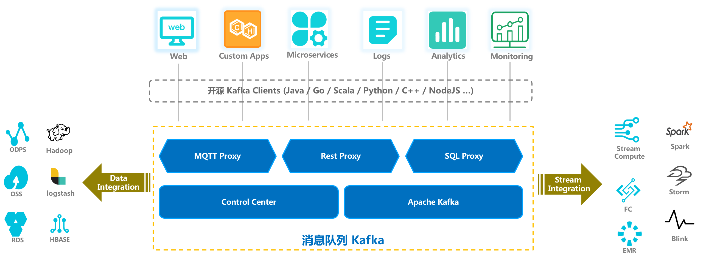
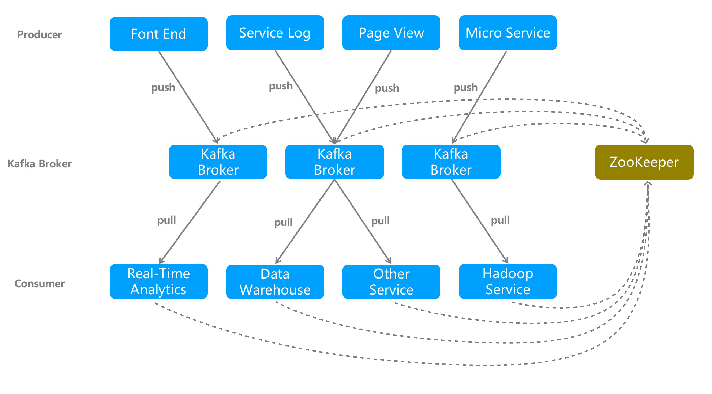

# Node下Kafka的应用
## 需要解决的问题
* Kafka 解决了什么问题？
* 好处是什么？
* 在此过程中有什么问题？
* 适用于哪些场景？[主要应用场景](https://help.aliyun.com/document_detail/68155.html?spm=a2c4g.11186623.6.542.t3BbUx)
> 网站活动跟踪、日志聚合、流计算处理、数据中转枢纽

## 消息队列Kafka的应用生态

* 消息队列 Kafka 广泛应用于大数据领域，如网站行为分析、日志聚合、Apps监控、流式数据处理、在线和离线分析等；
* 消息队列 Kafka 让数据集成变得简单，可能将 Kafka 上的消息导入到 ODPS、HBase、HBASE 等离线数据仓库；
* 消息队列 Kafka 可广泛与流计算引擎集成，包括阿里云平台的 StreamCompute、E-MapReduce 以及开源产品 Spark、Storm 等；

## Kafka 架构

## 名词解释
* Broker： 消息队列 Kafka 集群包含一个或多个消息处理服务器，该服务器被称为 Broker。
* Topic： 每条发布到消息队列 Kafka 集群的消息都有一个主题，这个主题被称为 Topic。通过 Topic 可以对消息进行分类。每个 Topic 可以由一个或多个 Partition 组成，存储于一个或多个 Broker 服务器上。
* 分区（Partition）： 消息分区，Partition 是物理上的概念，每个 Topic 包含一个或多个 Partition。
* Producer： 消息发布者，也称为消息生产者，负责生产并发送消息到 Kafka Broker。
* Consumer： 消息订阅者，也称为消息消费者，负责向 Kafka Broker 读取消息并进行消费。
* Consumer Group： 一类 Consumer 的标识，这类 Consumer 通常接收并消费同一类消息，且消费逻辑一致。Consumer Group 和 Topic 的关系是 N：N，同一个 Consumer Group 可以订阅多个 Topic，同一个 Topic 也可以对应多个 Consumer Group。