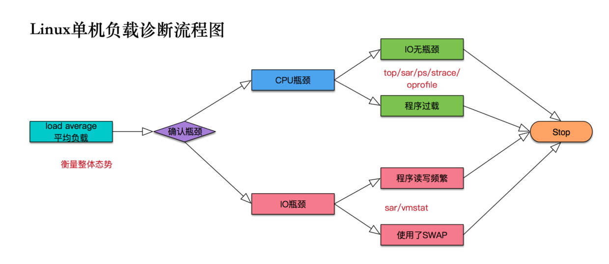

### Linux是如何启动的
#### boot初始化
1. 启动boot loader 它是操作系统内核运行之前的一小段程序，严重依赖硬件实现
2. 选择内核镜像，加载到内存空间，为最终调用操作系统内核准备好正确的环境
3. 初始化硬件设备及其驱动程序
4. 挂载根目录
5. 内核启动一个初始化程序，从这里，虚拟内存开始划分出使用者空间
6. 初始化剩余的操作系统进程
7. 有些时候，初始化启动一个进程的时候需要登录，这通常发生在boot运行结束左右的时期
#### linux内核初始化（对应上面的步骤2）
1. 检查CPU
2. 检查内存
3. 发现设备总线
4. 发现设备
5. 辅助内核子系统启动，如网络等
6. 挂载根目录
7. 用户空间启动

### 什么是负载
负载可以分为CPU负载、IO负载

