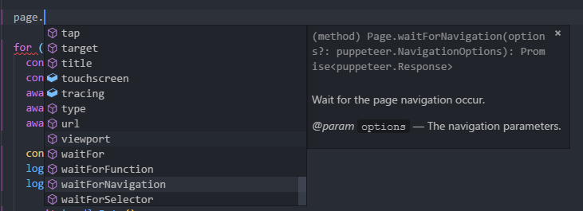

# Node：使用Puppeteer完成一次复杂的爬虫
## 架构图


* **Puppeteer** 通过 devTools 与 browser 通信
* **Browser** 一个可以拥有多个页面的浏览器(chroium)实例
* **Page** 至少含有一个 Frame 的页面
* **Frame** 至少还有一个用于执行 javascript 的执行环境，也可以拓展多个执行环境

## 前言
最近想要入手一台台式机，笔记本的i5在打开网页和vsc的时候有明显卡顿的情况，因此打算配1台 i7 + GTX1070TI or GTX1080TI的电脑，直接在淘宝上搜需要翻页太多，并且图片太多，脑容量接受不了，因此想爬一些数据，利用图形化分析一下最近价格的走势。因此写了一个用Puppeteer写了一个爬虫爬去相关数据。

## 什么是Puppeteer？
> Puppeteer is a Node library which provides a high-level API to control headless Chrome or Chromium over the DevTools Protocol. It can also be configured to use full (non-headless) Chrome or Chromium.

简而言之，这货是一个提供高级API的node库，能够通过devtool控制headless模式的chrome或者chromium，它可以在headless模式下模拟任何的人为操作。

## 和cheerio的区别
cherrico本质上只是一个使用类似jquery的语法操作HTML文档的库，使用cherrico爬取数据，只是请求到静态的HTML文档，如果网页内部的数据是通过ajax动态获取的，那么便爬去不到的相应的数据。而Puppeteer能够模拟一个浏览器的运行环境，能够请求网站信息，并运行网站内部的逻辑。然后再通过WS协议动态的获取页面内部的数据，并能够进行任何模拟的操作(点击、滑动、hover等),并且支持跳转页面，多页面管理。甚至能注入node上的脚本到浏览器内部环境运行，总之，你能对一个网页做的操作它都能做，你不能做的它也能做。

## 开始
本文不是一个手把手教程，因此需要你有基本的Puppeteer API常识，如果不懂，请先看看官方介绍
**[Puppeteer官方站点](https://github.com/GoogleChrome/puppeteer)**
**[PuppeteerAPI](https://github.com/GoogleChrome/puppeteer/blob/master/docs/api.md#)**

首先我们观察要爬去的网站信息 [GTX1080]('https://s.taobao.com/search?q=gtx1080&imgfile=&js=1&stats_click=search_radio_all%3A1&initiative_id=staobaoz_20180416&ie=utf8')
这是我们要爬取的淘宝网页，只有中间的商品项目是我们需要爬取的内容，仔细分析它的结构，相信一个前端都有这样的能力。

**我使用的Typescript，能够获得完整的Puppetter及相关库的API提示，如果你不会TS，只需要将相关的代码换成ES的语法就好了**
```javascript
// 引入一些需要用到的库以及一些声明
import * as puppeteer from 'puppeteer' // 引入Puppeteer
import mongo from '../lib/mongoDb' // 需要用到的 mongodb库，用来存取爬取的数据
import chalk from 'chalk' // 一个美化 console 输出的库

const log = console.log // 缩写 console.log
const TOTAL_PAGE = 50 // 定义需要爬取的网页数量，对应页面下部的跳转链接

// 定义要爬去的数据结构
interface IWriteData { 
  link: string // 爬取到的商品详情链接
  picture: string // 爬取到的图片链接
  price: number // 价格，number类型，需要从爬取下来的数据进行转型
  title: string // 爬取到的商品标题
}

// 格式化的进度输出 用来显示当前爬取的进度
function formatProgress (current: number): string { 
  let percent = (current / TOTAL_PAGE) * 100
  let done = ~~(current / TOTAL_PAGE * 40)
  let left = 40 - done
  let str = `当前进度：[${''.padStart(done, '=')}${''.padStart(left, '-')}]   ${percent}%`
  return str
}
```
接下来我们开始进入到爬虫的主要逻辑
```javascript
// 因为我们需要用到大量的 await 语句，因此在外层包裹一个 async function
async function main() {
  // Do something
}
main()
```

```javascript
// 进入代码的主逻辑
async function main() {
  // 首先通过Puppeteer启动一个浏览器环境
  const browser = await puppeteer.launch()
  log(chalk.green('服务正常启动'))
  // 使用 try catch 捕获异步中的错误进行统一的错误处理
  try {
    // 打开一个新的页面
    const page = await browser.newPage()
    // 监听页面内部的console消息
    page.on('console', msg => {
      if (typeof msg === 'object') {
        console.dir(msg)
      } else {
        log(chalk.blue(msg))
      }
    })

    // 打开我们刚刚看见的淘宝页面
    await page.goto('https://s.taobao.com/search?q=gtx1080&imgfile=&js=1&stats_click=search_radio_all%3A1&initiative_id=staobaoz_20180416&ie=utf8')
    log(chalk.yellow('页面初次加载完毕'))

    // 使用一个 for await 循环，不能一个时间打开多个网络请求，这样容易因为内存过大而挂掉
    for (let i = 1; i <= TOTAL_PAGE; i++) {
      // 找到分页的输入框以及跳转按钮
      const pageInput = await page.$(`.J_Input[type='number']`)
      const submit = await page.$('.J_Submit')
      // 模拟输入要跳转的页数
      await pageInput.type('' + i)
      // 模拟点击跳转
      await submit.click()
      // 等待页面加载完毕，这里设置的是固定的时间间隔，之前使用过page.waitForNavigation()，但是因为等待的时间过久导致报错（Puppeteer默认的请求超时是30s,可以修改）,因为这个页面总有一些不需要的资源要加载，而我的网络最近日了狗，会导致超时，因此我设定等待2.5s就够了
      await page.waitFor(2500)

      // 清除当前的控制台信息
      console.clear()
      // 打印当前的爬取进度
      log(chalk.yellow(formatProgress(i)))
      log(chalk.yellow('页面数据加载完毕'))

      // 处理数据，这个函数的实现在下面
      await handleData()
      // 一个页面爬取完毕以后稍微歇歇，不然太快淘宝会把你当成机器人弹出验证码（虽然我们本来就是机器人）
      await page.waitFor(2500)
    }

    // 所有的数据爬取完毕后关闭浏览器
    await browser.close()
    log(chalk.green('服务正常结束'))

    // 这是一个在内部声明的函数，之所以在内部声明而不是外部，是因为在内部可以获取相关的上下文信息，如果在外部声明我还要传入 page 这个对象
    async function handleData() {
      // 现在我们进入浏览器内部搞些事情，通过page.evaluate方法，该方法的参数是一个函数，这个函数将会在页面内部运行，这个函数的返回的数据将会以Promise的形式返回到外部 
      const list = await page.evaluate(() => {
        
        // 先声明一个用于存储爬取数据的数组
        const writeDataList: IWriteData[] = []

        // 获取到所有的商品元素
        let itemList = document.querySelectorAll('.item.J_MouserOnverReq')
        // 遍历每一个元素，整理需要爬取的数据
        for (let item of itemList) {
          // 首先声明一个爬取的数据结构
          let writeData: IWriteData = {
            picture: undefined,
            link: undefined,
            title: undefined,
            price: undefined
          }

          // 找到商品图片的地址
          let img = item.querySelector('img')
          writeData.picture = img.src

          // 找到商品的链接
          let link: HTMLAnchorElement = item.querySelector('.pic-link.J_ClickStat.J_ItemPicA')
          writeData.link = link.href

          // 找到商品的价格，默认是string类型 通过~~转换为整数number类型
          let price = item.querySelector('strong')
          writeData.price = ~~price.innerText
          
          // 找到商品的标题，淘宝的商品标题有高亮效果，里面有很多的span标签，不过一样可以通过innerText获取文本信息
          let title: HTMLAnchorElement = item.querySelector('.title>a')
  
          writeData.title = title.innerText

          // 将这个标签页的数据push进刚才声明的结果数组
          writeDataList.push(writeData)
        }
        // 当前页面所有的返回给外部环境
        return writeDataList
        
      })
      // 得到数据以后写入到mongodb
      const result = await mongo.insertMany('GTX1080', list)

      log(chalk.yellow('写入数据库完毕'))
    }

  } catch (error) {
    // 出现任何错误，打印错误消息并且关闭浏览器
    console.log(error)
    log(chalk.red('服务意外终止'))
    await browser.close()
  } finally {
    // 最后要退出进程
    process.exit(0)
  }
}
```

##思考
1. 为什么使用Typescript？

    因为Typescript就是好用啊，我也背不住Puppeteer的全部API，也不想每一个都查，所以使用TS就能智能提醒了,也能避免因为拼写导致的低级错误。基本上用了TS以后，敲代码都能一遍过
  

2. 爬虫的性能问题？

    因为Puppeteer会启动一个浏览器，执行内部的逻辑，所以占用的内存是蛮多的，看了看控制台，这个node进程大概占用300MB左右的内存。

    我的页面是一个个爬的，如果想更快的爬取可以启动多个进程，注意，V8是单线程的，所以在一个进程内部打开多个页面是没有意义的，需要配置不同的参数打开不同的node进程，当然也可以通过node的cluster(集群)实现，本质都是一样的
  我在爬取的过程中也设置了不同的等待时间，一方面是为了等待网页的加载，一方面避免淘宝识别到我是爬虫弹验证码

3. Puppeteer的其它功能

    这里仅仅利用了Puppeteer的一些基本特性，实际上Puppeteer还有更多的功能。比如引入node上的处理函数在浏览器内部执行，将当前页面保存为pdf或者png图片。并且还可以通过```const browser = await puppeteer.launch({ headless: false })```启动一个带界面效果的浏览器，你可以看见你的爬虫是如何运作的。此外一些需要登录的网站，如果你不想识别验证码委托第三方进行处理，你也可以关闭headless，然后在程序中设置等待时间，手动完成一些验证从而达到登录的目的。

    当然google制作了一个这么牛逼的库可不只是用来做爬虫爬取数据的，这个库也用作于一些自动化的性能分析、界面测试、前端网站监控等

4. 一些其它方面的思考

    总得来说制作爬虫爬取数据是一项较为复杂并考察多项基本功的练习项目，在这个爬虫里多次使用到了async，这就需要对async、Promise等相关知识充分的了解。在分析DOM收集数据时，也多次利用了原生的方法获取DOM属性(如果网站有jquery也可以直接用，没有的话需要外部注入，在typescript下需要进行一些配置，避免报错未识别的$变量，这样就可以通过jquery语法操作DOM)，考察了对DOM相关API的熟练程度。

    另外这只是一个面向过程的编程，我们完全可以将它封装为一个类进行操作，这也考察了对ES的OOP理解


## 最后
本文的源代码[Github](https://github.com/MrTreasure/Algorithm/blob/master/src/Puppeteer/index.ts),喜欢的朋友给个star吧

以上都是我瞎编的