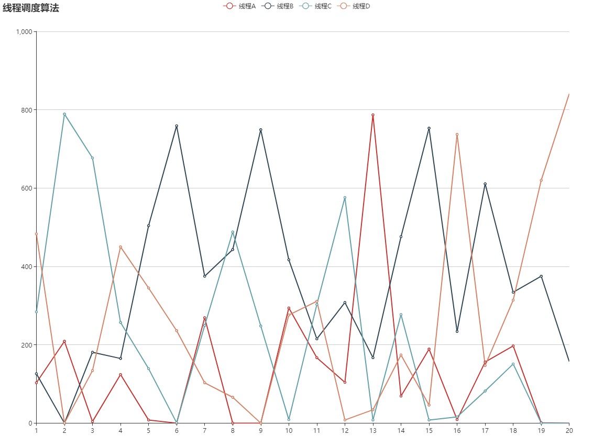

# Cluster集群学习

## 结论
* 虽然平常通过设置为CPU线程数的工作线程，但是可以超过这个数，并且并不是主线程先创建
```javascript
if (cluster.isMaster) {
  // 循环 fork 任务 CPU i5-7300HQ 四核四线程
  for (let i = 0; i < 6; i++) {
    cluster.fork()
  }
  console.log(chalk.green(`主线程运行在${process.pid}`))
} else {

  console.log(chalk.green(`子线程运行在${process.pid}`))
}
#子线程运行在17768
#子线程运行在5784
#子线程运行在11232
#子线程运行在7904
#主线程运行在12960
#子线程运行在4300
#子线程运行在16056
```
* 在主线程中 cluster 表示主线程(用于监听、发送事件), process 是本身的线程，worker 表示子线程，通过 cluster.workers 获取,该函数返回一个对象
* 在子线程中 process 表示子线程(用于监听、发送事件)

## 主线程子线程相互通信


* **cluster** 用于监听 process(child) 子线程触发的各种事件
* **worker** 只能在主线程中获取，用于和自身通信。当子线程触发事件时，会返回当前的 worker 以及相关的信息到主线程相应的事件中
* **process(parent)** 主线程本身的线程实例，在通信过程中基本没有用到
* **process(child)** 子线程本身的实例，只能在子线程获取用于监听自身的事件

可见主线程与子线程通过这样一个三角关系互相通信，其中 cluster 和 worker 是在主线程中获取的，process(child) 是子线程。 cluster 通过操作 worker 通知子线程，子线程本身和 cluster 进行通信。为什么要这样设计呢？因为子线程会有多个，只有通过 worker 才能选择和哪个线程通信

## 子线程的调度策略 cluster.schedulingPolicy

> 调度策略，包括循环计数的 cluster.SCHED_RR，以及由操作系统决定的cluster.SCHED_NONE。 这是一个全局设置，当第一个工作进程被衍生或者调动cluster.setupMaster()时，都将第一时间生效。除Windows外的所有操作系统中，SCHED_RR都是默认设置。只要libuv可以有效地分发IOCP handle，而不会导致严重的性能冲击的话，Windows系统也会更改为SCHED_RR。cluster.schedulingPolicy 可以通过设置NODE_CLUSTER_SCHED_POLICY环境变量来实现。这个环境变量的有效值包括"rr" 和 "none"。

RR 即 Round-Robin 轮询调度，即每个子线程的获取的事件的机会是均等的，这是除 windows以外默认的。而 windows 下的调度策略很诡异，见下图。目前并没有相关 API 可以设置调度策略的算法，node 只为我们提供了两个值


测试数据为 1000次 并发请求，重复测试20次，在windows下的表现情况。可见 windows 的调度算法表现的杂乱无章。如果是 RR 算法四条线程的调度应该处于同一横线上。暂时没在本地搭建 linux 环境，有条件的同学可以协助测试一波。
cluster的调度算法目前至于系统有关

本文相关代码在 [github](../src/cluster)