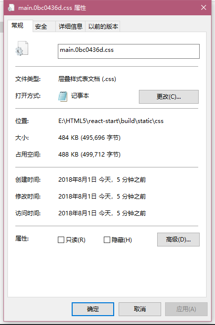

## 前言
最近有在使用 highlight.js 做代码的高亮展示，主要是展示对 SQL 语言的处理。看了看 highlight.js 的提供的相关代码


因为只需要加载对应语言的种类，以及一种样式，所以我们希望 webpack 能够按需加载

## 按需加载的实践

### 完全加载
为了对比出按需加载究竟能帮助我们节约多少资源，我们先贴出没有按需加载的代码
```typescript
// 忽略一些无关的代码
import * as hljs from 'highlight.js/lib/highlight'
import 'highlight.js/styles/atom-one-light.css'

export class Highlight extends React.Component {

  public componentDidMount() {
    hljs.highlightBlock((this.code as any))
  }

  public render() {
    return (
      <pre ref={ref => this.code = ref} style={{marginTop: 20}}>
        <code>{this.props.content}</code>
      </pre>
    )
  }
}
```
这是一份完整的加载，我们看看最后的数据有多大(包含完整引用的 antd 文件，我在项目中使用了 antd )


### 按需加载
接着我们按照官方的 demo 实现按需加载
```typescript
import * as hljs from 'highlight.js/lib/highlight'
import * as javascript from 'highlight.js/lib/languages/javascript'
hljs.registerLanguage('javascript', javascript)
```
其他的部分和上文相同，区别在于，没有从整个 highlight 中加载，而是引用了部分文件以及需要注册的 javascript 语言部分，默认是加载包含所有语言版本的 hljs ，看看这下的打包大小


我们可以看到，使用按需加载将近节省了600KB的空间，而使用按需加载的引入方式是
```import * as XXX from 'module/lib/xxx'```。并且使用 ```import { xx } from 'moduls'``` 并不能触发 webpack 的 treeshake，webpack仍然会打包完整库，哪怕引用的仅仅是从库里导出的接口(在ECharts下是如此表现的)。我们看看按需引用 antd 里的组件会是什么情况

### 部分按需引用
上面1.78MB的打包体积是 ```import { Card } from 'antd'```(如gif效果图，我用Card包裹了高亮组件),接着我们看看
```typescript
import Card from 'antd/lib/card'
```

这种方式最后的打包体积


妈耶，居然这么小。

### 小结
1. 如果要实现按需加载得使用[babel-plugin-import](https://github.com/ant-design/babel-plugin-import),这个在TS下的情况还没有检查过
2. 使用TS时，因为某些库的 d.ts 文件 指向的路径是模块，因此要导入该库的接口只能完整的导入该模块，比如ECharts，这个问题目前暂时还未解决

## 动态加载的实践
上面只是按需加载部分的JS，并且通过字符串写死的方式指定了路径，还有一部分，如同CSS的部分需要在组件生成时动态加载，或者通过变量的形式加载。如下所示
```typescript
  constructor(props) {
    super(props)
    require('highlight.js/styles/' + this.props.css)
  }

  static async getDerivedStateFromProps(nextProps) {
    // const css = await import('highlight.js/styles/' + nextProps.css)
    const css = require('highlight.js/styles/' + nextProps.css)
    console.log(css)
    return null
  }
```
我们在构造阶段通过props传过来的变量加载对应的CSS文件，之前是使用```import 'highlight.js/styles/atom-one-light.css'```的方式，我们看看两者打包体积的区别




通过指定加载的CSS体积大小是427KB，而动态加载的体积大小是484KB。动态加载的体积要比静态加载的体积大很多。分析一下webpack打包的行为

webpack始终结合关键字并按照静态地址信息进行打包。比如```require('highlight.js/styles/' + nextProps.css)```
require是关键字，接下来 webpack 会对 require 这个函数中的入参进行分析，它会发现入参有两个部分构成， 一部分是硬编码的 'highlight.js/styles/' 另一部分是不可知的变量。webpack将会以硬编码部分为打包入口，将'highlight.js/styles/*'下所有文件打包，在运行时根据完整的路径记载资源。

所以我们没办法使用完全的变量 require(variable)，因为这样webpack找不到打包的路径。

### 缺陷
效果图虽然能看到我们通过 Select 的选择按需加载 CSS 样式，但其实是有缺陷的，表现为右侧可以看到，动态加载的CSS是通过一个个style标签加载上去的，这样后面的样式效果会覆盖前面的。表现为 当 Select 又选到已经加载的样式时， 浏览器并不会重新加载那段代码，导致样式无效。这个问题在另一个组件中得到了解决
[react-syntax-highlighter](https://github.com/conorhastings/react-syntax-highlighter)

还没来得及看具体的实现，不过我估计应该是使用了 CSS-MODULES，明天再看看

### 没来得及验证的部分
有注意到 我在使用 ```const css = await import('xxx')```,```const css = require('xxx')```,这两者的表现上是有区别的，前者是一个Promise对象，后者直接返回了值，这就涉及到了一个同步和异步的问题，虽然最后打印出来都是 {}， 不过这是因为没有使用CSS modules的原因。以后再研究研究 import require 动态加载时的区别

## 总结
1. ```import { Card } from 'antd'```并不会触发按需加载,仍然会加载全部antd文件,应该使用```import Card from 'antd/lib/Card'```
2. 使用变量加载```require('highlight.js/styles/' + this.props.style)``` webpack会打包 ```'highlight.js/styles/*'```下所有文件
3. 猜想 在TS下即使只从某个库里引用接口, ```import { IXxx } from 'xxx'```,webpack仍然会打包所有的 'xxx' 文件(在ECharts的表现下如此)

以上都是我瞎编的