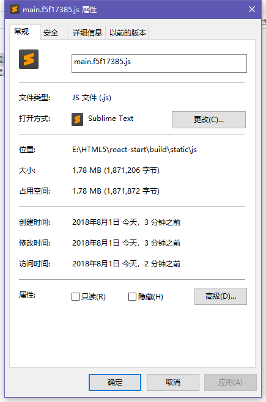
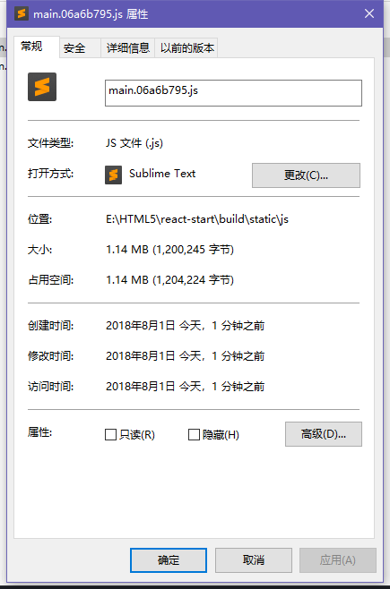
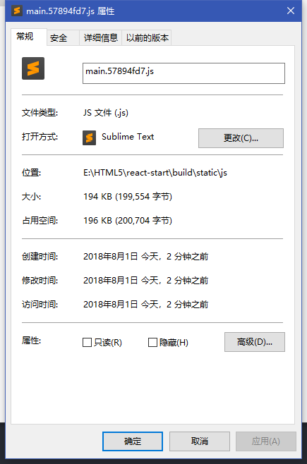

## 前言
最近有在使用 highlight.js 做代码的高亮展示，主要是展示对 SQL 语言的处理。看了看 highlight.js 的提供的相关代码


因为只需要加载对应语言的种类，以及一种样式，所以我们希望 webpack 能够按需加载

## 按需加载的实践

### 完全加载
为了对比出按需加载究竟能帮助我们节约多少资源，我们先贴出没有按需加载的代码
```typescript
// 忽略一些无关的代码
import * as hljs from 'highlight.js/lib/highlight'
import 'highlight.js/styles/atom-one-light.css'

export class Highlight extends React.Component {

  public componentDidMount() {
    hljs.highlightBlock((this.code as any))
  }

  public render() {
    return (
      <pre ref={ref => this.code = ref} style={{marginTop: 20}}>
        <code>{this.props.content}</code>
      </pre>
    )
  }
}
```
这是一份完整的加载，我们看看最后的数据有多大(包含完整引用的 antd 文件，我在项目中使用了 antd )



### 按需加载
接着我们按照官方的 demo 实现按需加载
```typescript
import * as hljs from 'highlight.js/lib/highlight'
import * as javascript from 'highlight.js/lib/languages/javascript'
hljs.registerLanguage('javascript', javascript)
```
其他的部分和上文相同，区别在于，没有从整个 highlight 中加载，而是引用了部分文件以及需要注册的 javascript 语言部分，默认是加载包含所有语言版本的 hljs ，看看这下的打包大小



我们可以看到，使用按需加载将近节省了600KB的空间，而使用按需加载的引入方式是
```import * as XXX from 'module/lib/xxx'```。并且使用 ```import { xx } from 'moduls'``` 并不能触发 webpack 的 treeshake，webpack仍然会打包完整库，哪怕引用的仅仅是从库里导出的接口(在ECharts下是如此表现的)。我们看看按需引用 antd 里的组件会是什么情况

### 部分按需引用
上面1.78MB的打包体积是 ```import { Card } from 'antd'```(如gif效果图，我用Card包裹了高亮组件),接着我们看看
```typescript
import Card from 'antd/lib/card'
```

这种方式最后的打包体积



妈耶，居然这么小，那么问题就来了。

### 小结
1. 

## 结论
1. ```import { Card } from 'antd'```并不会触发按需加载,仍然会加载全部antd文件,应该使用```import Card from 'antd/lib/Card'```
2. 使用变量加载```require('highlight.js/styles/' + this.props.style)``` webpack会打包 ```'highlight.js/styles/*'```下所有文件
3. 猜想 在TS下即使只从某个库里引用接口, ```import { IXxx } from 'xxx'```,webpack仍然会打包所有的 'xxx' 文件(在ECharts的表现下如此)