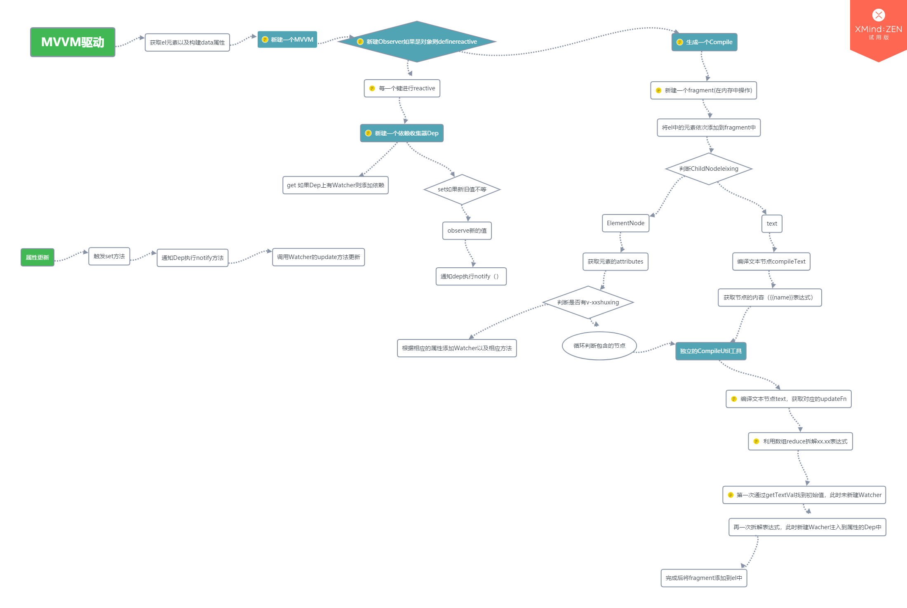

## 前言
面试的时候问起vue的原理，大部分的人都会说通过Object.defineProperty修改属性的get, set方法，从而达到数据改变的目的。然而作为vue的MVVM驱动核心，从数据的改变到视图的改变，远远不止这句话就能解释，而是通过Observer, Dep, Watcher, Compile 4个类以及一个CpompileUtil辅助类完成，本文将以深入浅出的方式，分析从初始化DOM和data到数据的渲染，MVVM背后究竟发生了什么

本文代码翻译于文章
[掘金——看完这篇关于MVVM的文章，面试通过率提升了80%](https://juejin.im/post/5af8eb55f265da0b814ba766)

## 源码
本文源码 [github](../src/vue/mvvm.ts) 欢迎star

## 思维导图


## 开始

### 构建一个MVVM实例
首先构建一个DOM以及一个数据源data，通过这两个属性，构建一个vm实例，接着构建一个Observer对象
```javascript
  constructor (options) {
    this.$el = options.el
    this.$data = options.data

    if (this.$el) {
      let _
      _ = new Observer(this.$data)
      this.proxyData(this.$data)
      _ = new Compile(this.$el, this)
    }
  }
```

### Observer
```javascript
  constructor (data) {
    this.observe(data)
  }
```
Observer的构造方法中将会调用observe方法遍历检测每一个属性，如果该属性不是对象则返回，否则调用defineReactive方法拦截每一个属性的get, set方法，defineReactTive也会新建一个依赖收集器Dep

### Dep
```javascript
class Dep {
  static target: Watcher

  private subs: Watcher[] = []

  public addSub (sub: Watcher) {
    this.subs.push(sub)
  }

  public notify () {
    this.subs.forEach(watcher => watcher.update())
  }

}
```
这个依赖收集器的代码比较简单，内置一个Watcher数组，当defineReactive修改属性的get方法时，根据Dep.target是否存在将Wathcher加入到Dep的数组中，每次属性改变set时，调用这个属性的Dep.notify方法通知订阅该属性的Watcher修改自己的状态

### Compile(在Vue中，这个步骤是交给virtualDOM完成的，这里只是简单的实现一个文本节点的编译)
完成数据项的响应适配后(defineReactive, 生成Dep两个步骤),接着开始编译绑定的el节点
```javascript
  constructor (el: any, vm: MVVM) {
    this.el = this.isElementNode(el) ? el : document.querySelector(el)
    this.vm = vm
    if (this.el) {
      const fragment = this.node2fragment(this.el)

      this.compile(fragment)

      this.el.appendChild(fragment)
    }
  }
```
首先很重要的一步，将el的childNodes创建为一个fragment，这样接下来就能够在内存中对DOM结构进行操作，避免频繁的访问真实DOM带来性能的开销问题。

### 根据fragment进行编译
根据每一个childNode进行判断其类型

如果childNode是一个Element的元素，则获取其attributes属性，判断其中有无相应的指令v-xx等，根据其指令在CompileUtil中找到方法，然后添加到Dep中。继续递归调用compile方法，直到最终的node类型为text为止

如果childNode是一个text类型的Node，在调用compileText方法

### compileText
获取该节点的textContent属性，其中的值就是expr表达式，接着调用CompileUtil中的方法对整个expr进行操作

### CompileUtil
找到CompileUtil的对应的updateFn方法，利用数组的reduce拆解expr并获取属性，这里设计的很巧妙
```javascript
static setVal (vm: MVVM, expr, value) {
  expr = expr.split('.')
  return expr.reduce((prev, next, currentIndex) => {
    if (currentIndex === expr.length - 1) {
      return prev[next] = value
    }
    return prev[next]
  }, vm.$data)
}
// 已school.profession为例，调用这个方法将会拆解为
// ['school', 'profession']
// vm.$data.school
// vm.$data.school.profession
```
在进行编译的时候，有两次获取到对应的vm.$data中的属性。第一次是为了在初次构建的时候获取值进行DOM的渲染，此时Dep.target为null，第二次是为了将updateFn添加到属性的Dep中。这里便解释了为什么进行Dep添加时为什么要判断是否存在Dep.target对象。因为初始化的时候，并不需要进行依赖收集

### 数据发生改变
当data中的某一项数据发生改变时，将调用这个属性的Dep的notify方法，通知订阅了该属性的Watcher调用自身的update方法改变DOM

## 总结
1. vue就是通过以上的几个类实现了完整的MVVM模式，不同的是vue拥有更加完整的CpmpileUtil方法，针对每一个指令以及一些绑定添加特殊的updateFn方法。vue也使用了virtualDOM统一管理了对于DOM的操作
2. 纵观这个MVVM的实现，发现其核心思想还是订阅发布模式，每一个属性都有一个依赖收集器，每个使用到这个属性的DOM或者衍生属性都会向依赖收集注册一个自身的方法，当属性发生改变时，Dep将通知他们执行自身的方法，这里也是一个高度解耦的设计。而这种基于事件改变的订阅发布模式，也是整个JS无论前端后者后端的灵魂所在
3. 还没有深入研究vue的computed、methods以及watch属性的实现，不过从现有的代码来看，可能就是各自实现了独特的Watcher，其中有着不同的updateFn方法

以上都是我瞎编的


