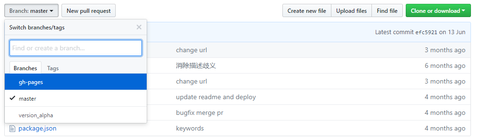
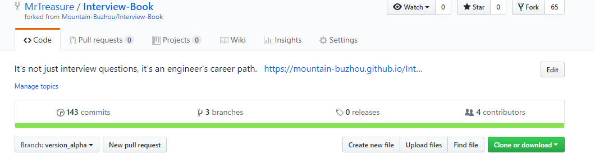
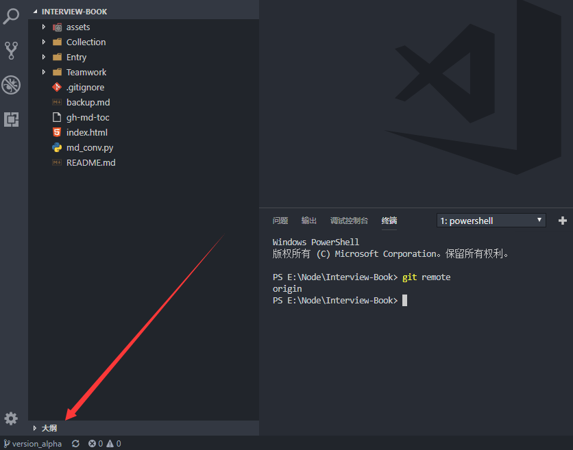
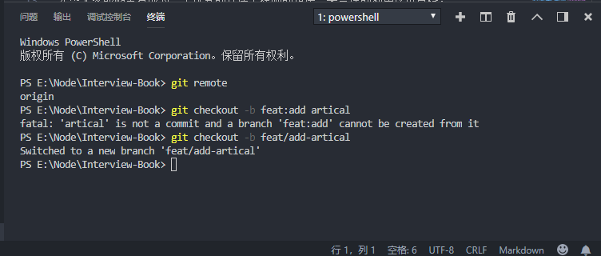
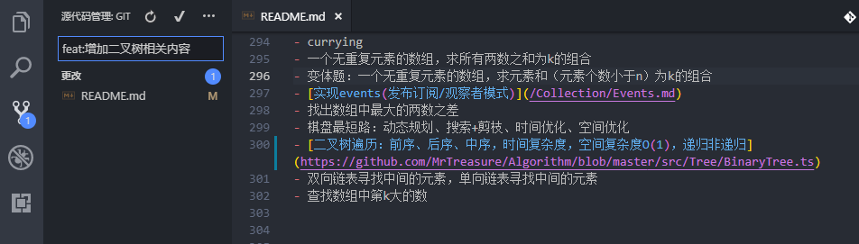
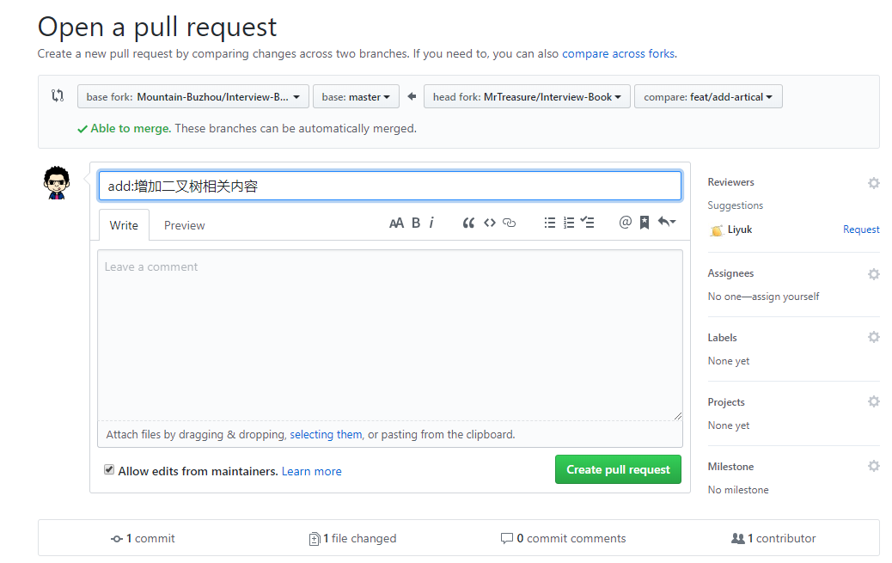
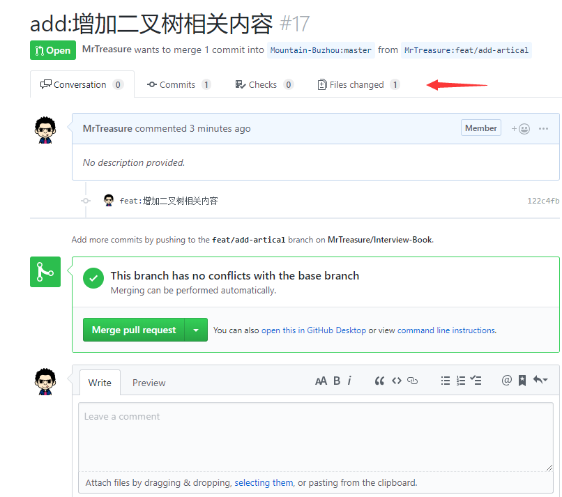
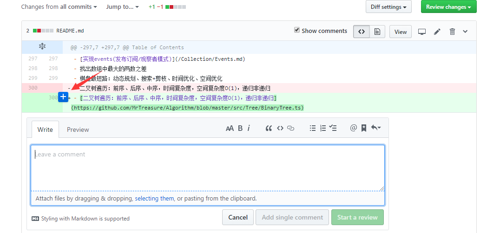
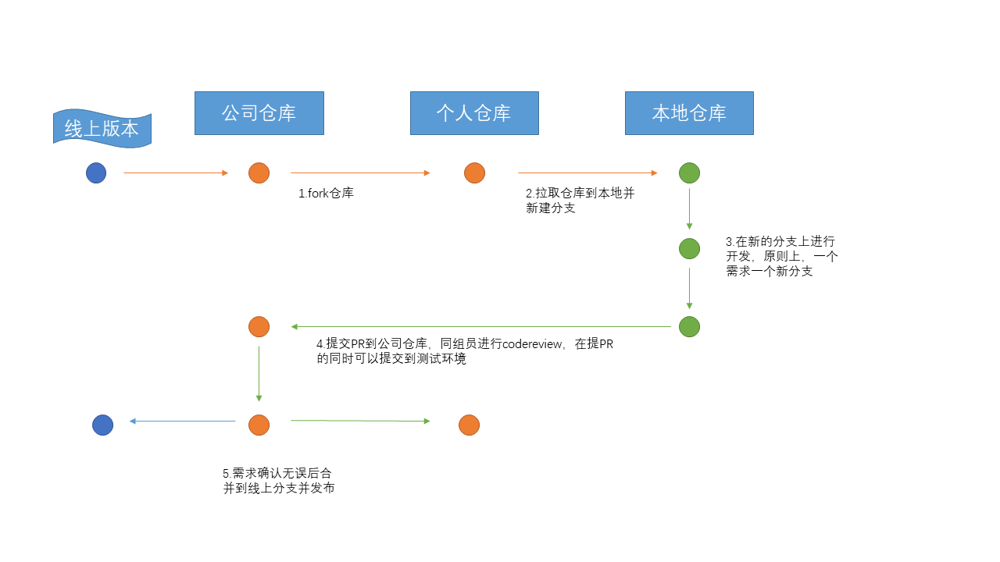

## 前言
  大厂有着数量庞大的代码库以及复杂的权限验证体系，囊括着开发、测试、上线的完整流程。因此必然会有一套代码仓库的管理流程，而不再是个人的代码随意开发、随意提交。这也是我从小厂出来学习到的第一堂课——完整的git提交流程。下面我们以一位头条大佬的仓库为例，讲解如何对线上仓库进行开发

## fork仓库
[Interview-Book](https://github.com/Mountain-Buzhou/Interview-Book) 这是头条大佬的仓库，我们可以看到他的分支信息
 我们可以看到有三个分支。假定这是一个发布到生产环境的应用，master一般用来存放线上分支，即这个仓库存放的是线上正在运行的代码，另外的仓库便是开发分支，一般会把开发分支设置为默认仓库，避免误提交代码线上(线上一般会禁止提交)，我们先fork一个到自己的仓库

## 本地开发

接着我们就可以clone仓库到本地


拉取到本地后注意 VSC 右下角的分支，github默认是master分支，要手动切换到开发分支，并在remote中添加线上仓库
```bash
git remote add upstream https://github.com/Mountain-Buzhou/Interview-Book
```
远程仓库是头条大佬的仓库，并且一般自己的github仓库命名为origin 线上仓库命名为upstream。这个时候我们就有了三个仓库，分别是:
1. 线上仓库(发布项目的git仓库，一般是拥有者是团队或TL)
2. 自己仓库(自己fork线上仓库到自己的github)
3. vscode本地仓库(git还在本地有一个仓库)

到目前为止，我们还不能直接进行开发，而需要从这个dev仓库(在这里是version_alpha)切出一个分支
```bash
git checkout -b feat/add-artical
```
命名为feat:xxx, 即新添加的需求

我们切换了一个新的分支，在这个新的分支上添加一些修改

我把以前写的一篇二叉树相关的文章添加到头条大佬Book中，接着进行commit, commit的内容也应该遵守规范，一般来说是
1. fix:xx  表示修改了XX代码
2. feat:xx 新增了XX需求
3. style:xx 修改了部分的样式
4. delete:xx 删除了某些无用的部分

标题最好能简短的描述出这个commit干了些什么，具体内容可以在comment中详细写

## 提交PR

feat感觉命名错了，因此改成了add:增加二叉树相关内容


在合并之前我们需要做codereview, 在我们小组所有进行合并的代码必须要进行codereview并且每一个组员都可以参加，codereview是让自己进行提升以及帮助别人纠错的一个重要途径。通过看别人的代码，可以了解到不同的思维。点击 Files changed查看这次更改的代码


在代码的行数处，鼠标移到上面就会出现一个 + 号，点击便可以出现一个浮动的 comment 框，我们就可以针对这行代码进行提问

## 合并PR
确认无误后，我们便可以等待头条大佬合并PR到dev(这里是version_alpha)分支，头条大佬合并以后我们就可以在本地仓库 切换到自己的 远程分支 origin/dev 拉取 upstream/dev到本地，然后再推送到 origin/dev 这样就完成了一次完整的 PR

## hotfix
有些时候产品会要求紧急上线一个需求，这个时候需要在线上的代码更新，因此我们会从线上分支切一个分支到自己仓库，然后在这个分支上进行修改，修改完以后会提两个PR命名为：hotfix:xxx 到dev仓库和master仓库

## 完整的流程
